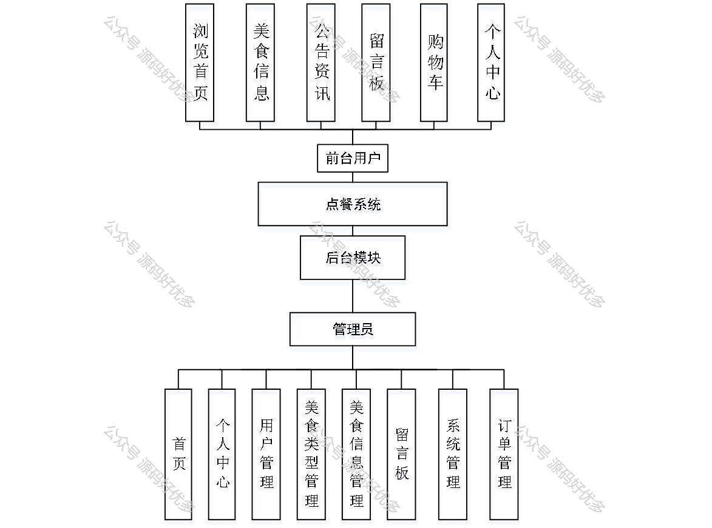
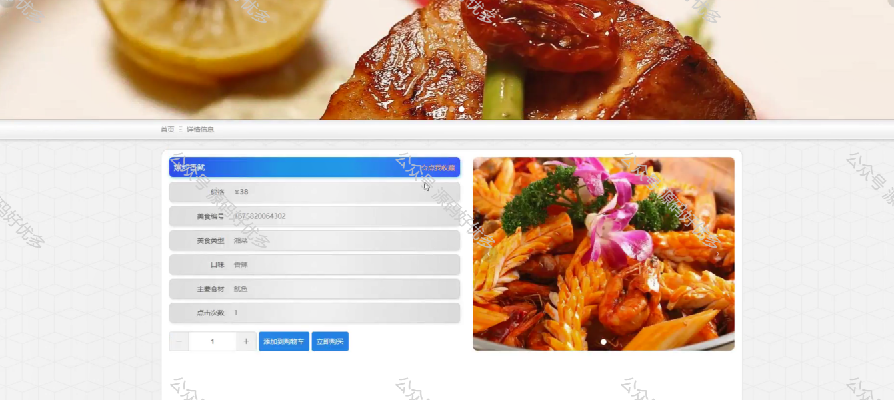
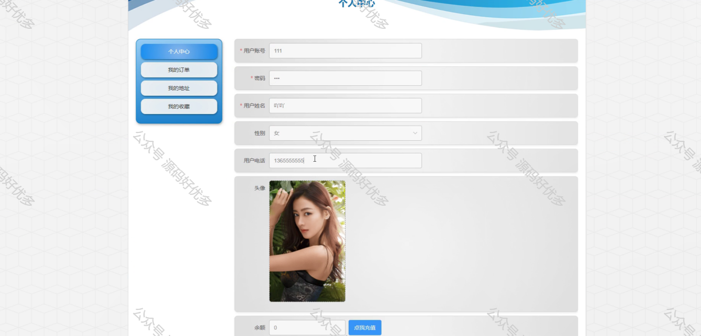
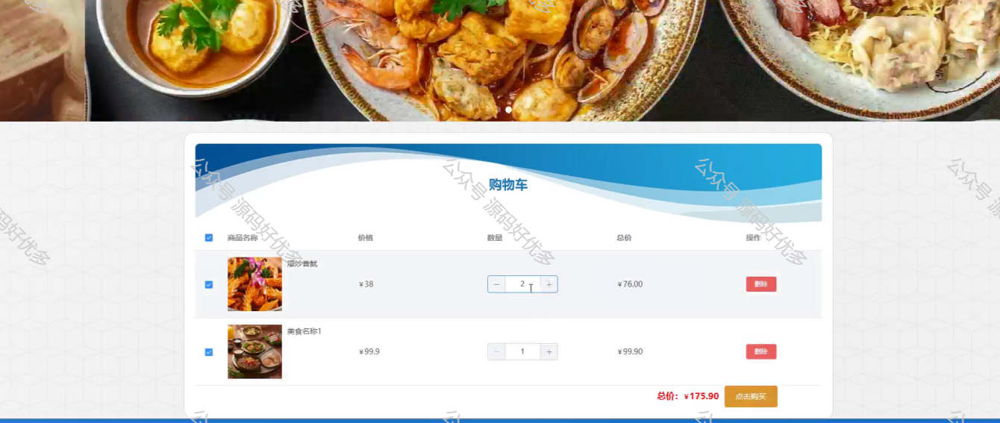
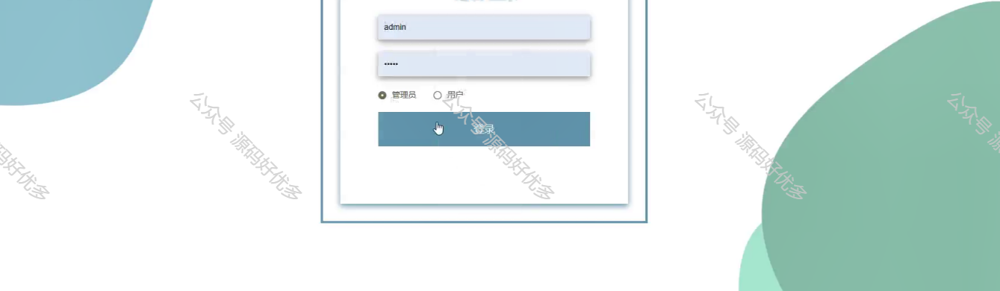
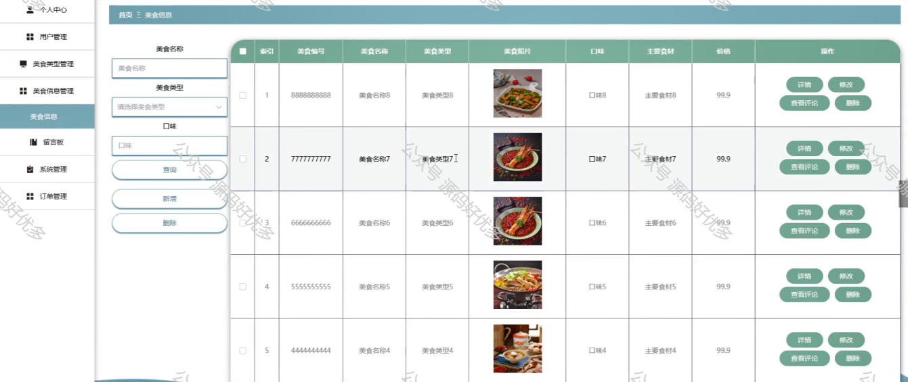
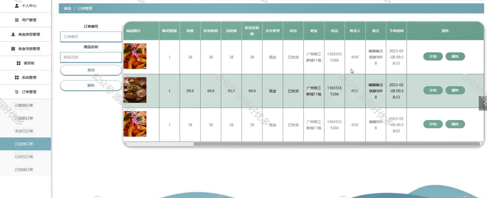
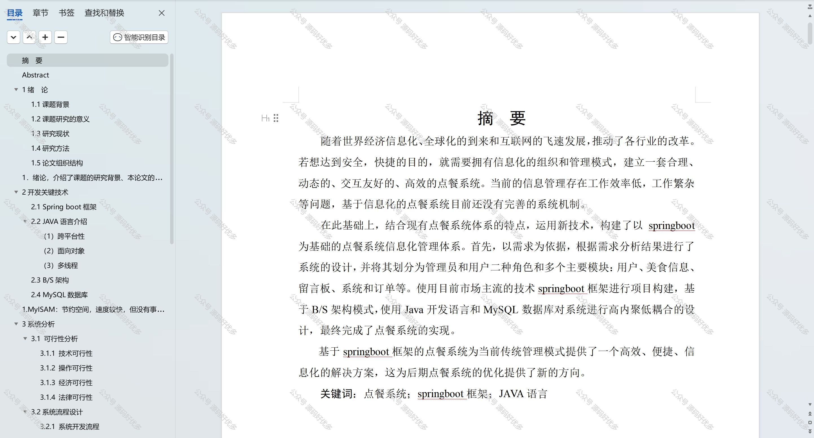

 
## 查看主页获取源码

### 一、作品包含

源码+数据库+设计文档万字+PPT+全套环境和工具资源+部署教程

### 二、项目技术

前端技术：Html、Css、Js、Vue、Element-ui

数据库：MySQL

后端技术：Java、Spring Boot、MyBatis

  

### 三、运行环境

开发工具：IDEA/eclipse

数据库：MySQL5.7

数据库管理工具：Navicat10以上版本

环境配置软件： JDK1.8+Maven3.6.3

前端Nodejs：14

### 四、项目介绍
项目编号：springbootA253

点餐系统是餐饮行业数字化转型的关键组成部分，它通过电子化手段，为顾客提供了一个更加便捷、高效的点餐体验。随着移动设备的普及和互联网技术的发展，点餐系统已成为餐厅提升服务质量、优化运营效率、增强顾客满意度的重要工具。它不仅能够减少顾客等待时间，提高餐厅的服务效率，还能够帮助餐厅更好地了解顾客需求，提升服务质量，为顾客提供更加个性化的服务。

前台用户功能：浏览首页、美食信息、公告资讯、留言板、购物车、个人中心。

后台管理员的功能：首页、个人中心、用户管理、美食类型管理、美食信息管理、留言板、系统管理、订单管理。

### 五、运行截图

  
